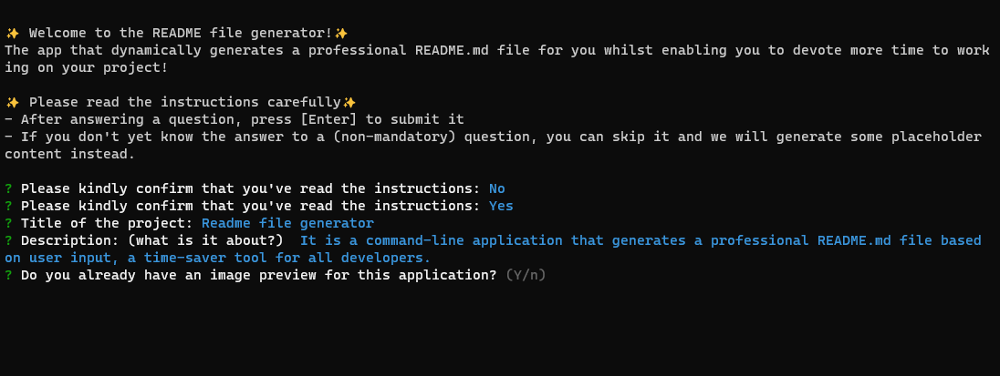

# README FILE GENERATOR

## 🚩 TABLE OF CONTENT

- [Description](#-description)
- [Usage](#-usage)
- [Technology used](#-technology-used)
- [Installation](#-installation)
- [Tests](#-tests)
- [Credits](#-credits)
- [Contributing](#-contributing)
- [Questions](#-questions)
- [License](#-license)

## 📖 DESCRIPTION

### 🎯 What is it about?

It is a command-line application that generates a professional README.md file based on user input, a time-saver tool for all developers.

### 🔍 Preview

The following image shows the web application's appearance and functionality:

## 💻 USAGE

This is a command-line application that runs with Node.js.

### 💬 User story

`As a developer, I want to use the README file generator to generate a README file for my project so that I can devote more time to working on my project.`

## ✅ TECHNOLOGY USED

-Javascript

-Npm

-Node.js

## 🚀 INSTALLATION

To use the app, you will need to have node.js installed then run `npm install inquirer`.

## ✅ TESTS

No tests available at the moment.

## 💬 CREDITS

**Badges**

- [Shields.io](https://shields.io/)
- [License badge repository](https://gist.github.com/lukas-h/2a5d00690736b4c3a7ba)
- [Simple Icons](https://simpleicons.org/)
- [Simple Icons Slugs](https://github.com/simple-icons/simple-icons/blob/develop/slugs.md)

**Inquirer.js**

- [Documentation](https://www.npmjs.com/package/inquirer)
- [Examples](https://github.com/SBoudrias/Inquirer.js)

**Input validation**

- [Regex101](https://regex101.com/)
- [Email validation Regex](https://www.w3schools.blog/email-validation-javascript-js)
- [Github username validation](https://docs.github.com/en/github-ae@latest/admin/identity-and-access-management/managing-iam-for-your-enterprise/username-considerations-for-external-authentication)

**README requirements**

- [Professional README guide](https://coding-boot-camp.github.io/full-stack/github/professional-readme-guide)
- [Readme.so](https://readme.so/editor)

**Video**

- [Screenpresso](https://www.screenpresso.com/) - to record
- [ClipChamp] (https://www.clipchamp.com/) - to edit

- **Thank you**

- [Clobee](https://github.com/clobee) for helping me with Regex
- My tutor for explaining the concept of async functions
- My teachers and classmates at Trilogy Skills Bootcamp

## ✨ CONTRIBUTING

All contributions are welcome. Contribution guidelines will be available soon.

## ❔ QUESTIONS

- If you have any questions, [please click here to send me an email.](mailto:senseilein@protonmail.com)
- You can also visit my Github profile [@senseilein.](https://github.com/senseilein)

## 📃 LICENSE

This application is covered under MIT License.
