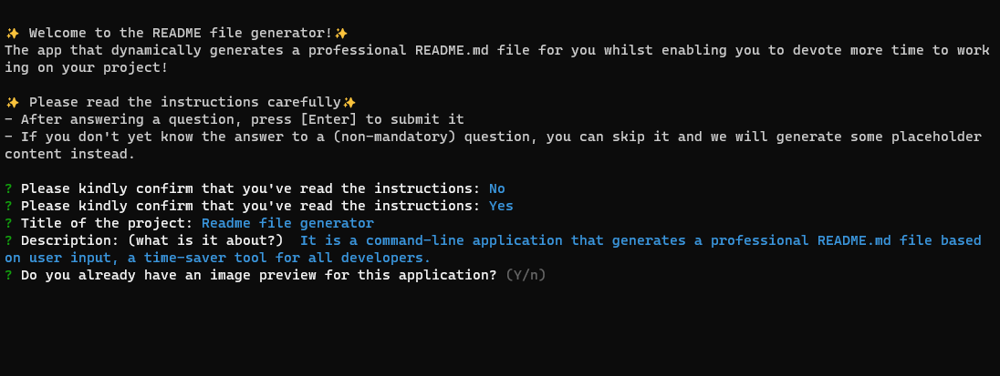

# README FILE GENERATOR
[](https://opensource.org/licenses/MIT)

  
  
  

  ## 🚩 TABLE OF CONTENT
- [Description](#-description)
- [Usage](#-usage)
- [Technology used](#-technology-used)
- [Installation](#-installation)
- [Tests](#-tests)
- [Credits](#-credits)
- [Contributing](#-contributing)
- [Questions](#-questions)
- [License](#-license)

## 📖 DESCRIPTION  

### 🎯 What is it about?  

It is a command-line application that generates a professional README.md file based on user input, a time-saver tool for all developers.  

### 🔍 Preview  
The following image shows the web application's appearance and functionality:  



## 💻 USAGE

### 💬 User story
````As a developer, I want to use the README file generator to generate a README file for my project so that I can devote more time to working on my project.````

### 💬 Main functionalities
      This is a command-line application that runs with Node.js.
      

## ✅ TECHNOLOGY USED
- Javascript


- Node.js


- Npm


  
## 🚀 INSTALLATION
To use the app, you will need to have node.js installed then run `npm install inquirer`.

## ✅ TESTS
No tests available at the moment.
  

## 💬 CREDITS

  - Lorem ipsum dolor sit amet, consectetur adipiscing elit, sed do eiusmod tempor incididunt ut labore et dolore magna aliqua. 
  - Blandit aliquam etiam erat velit scelerisque in. Placerat vestibulum lectus mauris ultrices eros in. 
  - Cursus metus aliquam eleifend mi in nulla. Sagittis orci a scelerisque purus semper eget duis at tellus.
  
## ✨ CONTRIBUTING
  All contributions are welcome. Contribution guidelines will be available soon.
  
## ❔ QUESTIONS
  - If you have any questions, [please click here to send me an email.](mailto:senseilein@senseilein.com) 
  - You can also visit my Github profile [@senseilein](https://github.com/senseilein).
  
## 📃 LICENSE  
This application is covered under MIT License.
